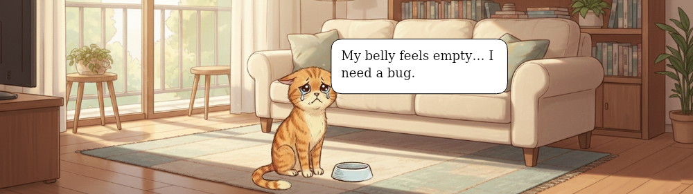

<!-- GENERATED: do not edit; run npm run generate-readme -->

<h1> Hey! Nice to see you.</h1>

I'm Aldo, Full Stack TypeScript Developer from  <b>Jakarta, Indonesia</b>. Even after 6+ years since my first `Hello World`, I feel like the open-source world only gets more exciting. What about you?

## ⚒️ Things That I Mostly Use Daily

## 🧑‍💻 My Open-Source Journey

I enjoy designing systems that scale and last, not just shipping features.

- Authoring [did:klayr](https://github.com/aldhosutra/klayr-did/blob/main/packages/klayr-did-module/docs/did-method-spec.md), an [officially recognized W3C DID Methods](https://www.w3.org/TR/did-extensions-methods/) for an L1 sidechain platform, implemented through [klayr-did](https://klayr-did.js.org).
- Publishing several npm packages, including [reqoal](https://reqoal.js.org) and [swgear](https://swgear.js.org), which helps scaling [klayr-service](https://github.com/klayrHQ/klayr-service) backend to 900%+ more RPS.
- Develops several web3 npm tools, such as [ipfs-cluster-service](https://www.npmjs.com/package/ipfs-cluster-service) and [ipfs-cluster-ctl](https://www.npmjs.com/package/ipfs-cluster-ctl).
- [and many more](https://github.com/aldhosutra?tab=repositories)

## 😽 Oh, Before Your Leave

Exploring open source sometimes makes me forget to give extra attention to **Dal-Meow**, my cat. If you’re visiting my GitHub and notice you can play with her below, feel free to jump in, she’d love it. It’s fun, I promise 😆

> The cat is hungry. Let's feed it with the right bug.

    

🏆 Leaderboard & Stats

    

| Rank | User | Score |
| ---- | ---- | ----- |
| 1 | [aldhosutra](https://github.com/aldhosutra) | 2 |

<!-- EASTER_EGG: Ahhh you found me! By the way, only between us, I love playing silksong! -->
